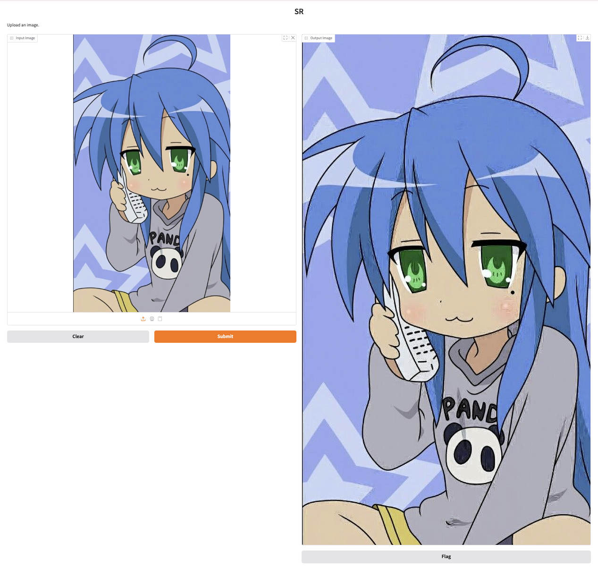

# simple-super-resolution-gradio

Simple web launcher for 4x super-resolution using unofficial GigaGAN implementation(https://github.com/fal-ai/aura-sr)



# Install

```sh
pip install git+https://github.com/Kitsunetic/simple-super-resolution-gradio.git
```

# Run

Just run this command:
```sh
# basic
sr

# use public link
sr --public

# increase batch size to accelerate by using more memory
# 8 batch size (default) usually uses ~6GB
sr --batch_size=16
```

Then it shows log like this:
```
Fetching 6 files: 100%|████████| 6/6 [00:00<00:00, 3320.91it/s]
* Running on local URL:  http://127.0.0.1:7861
* Running on public URL: https://8b07d37fe5aaf32ad0.gradio.live

This share link expires in 1 week. For free permanent hosting and GPU upgrades, run `gradio deploy` from the terminal in the working directory to deploy to Hugging Face Spaces (https://huggingface.co/spaces)
```
